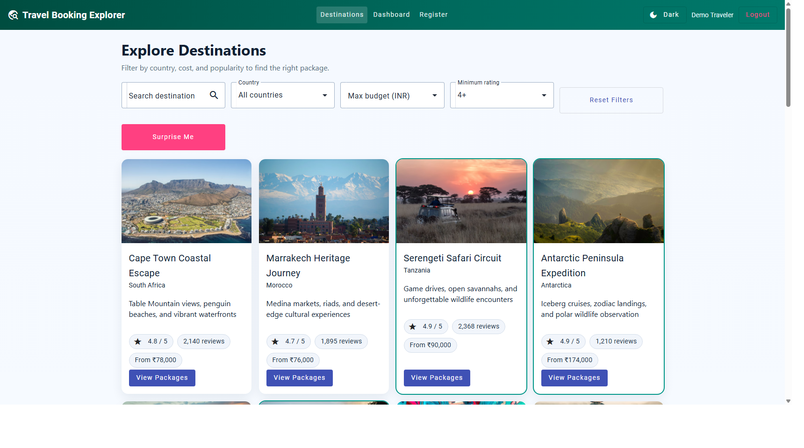
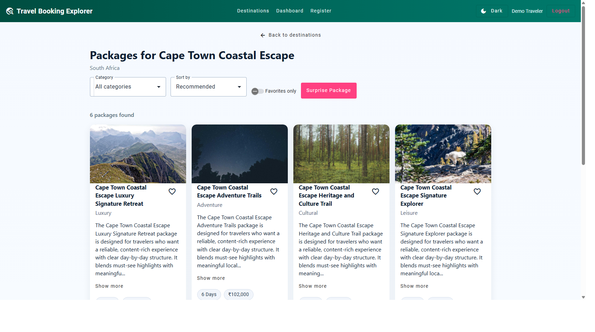
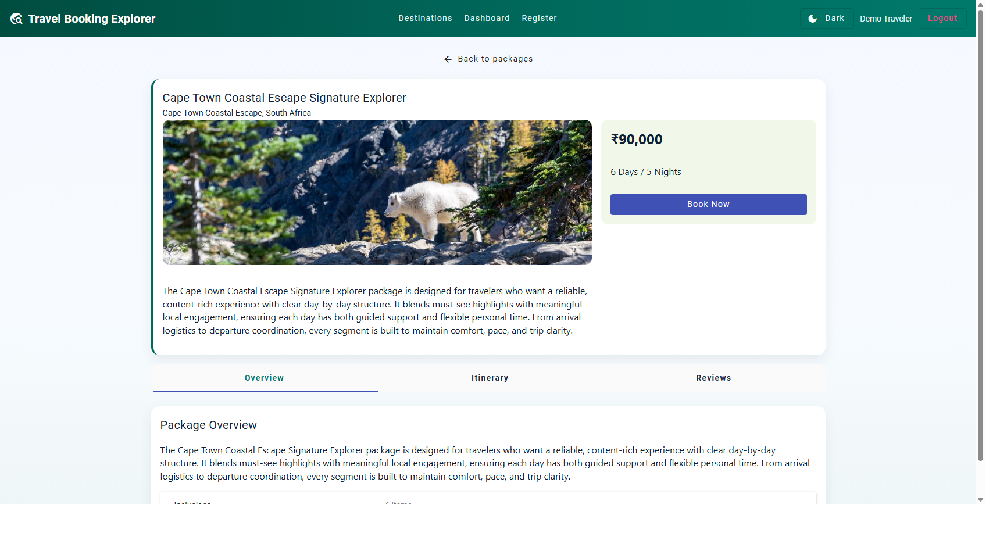
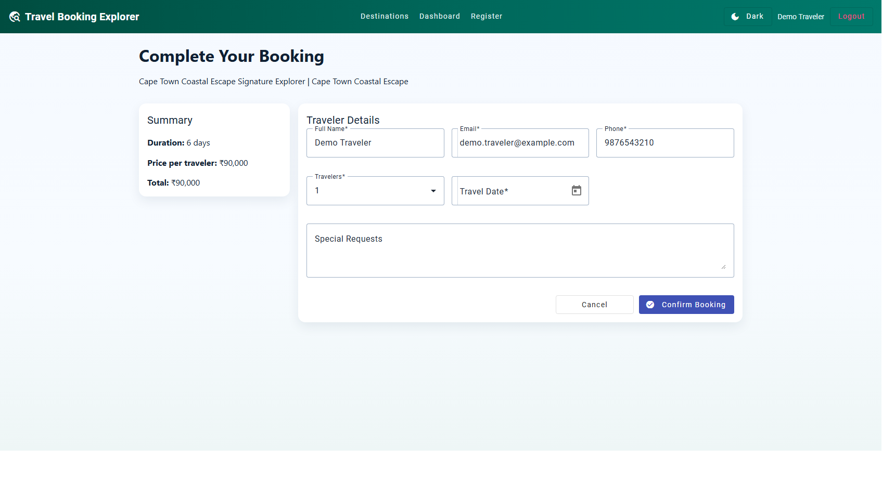
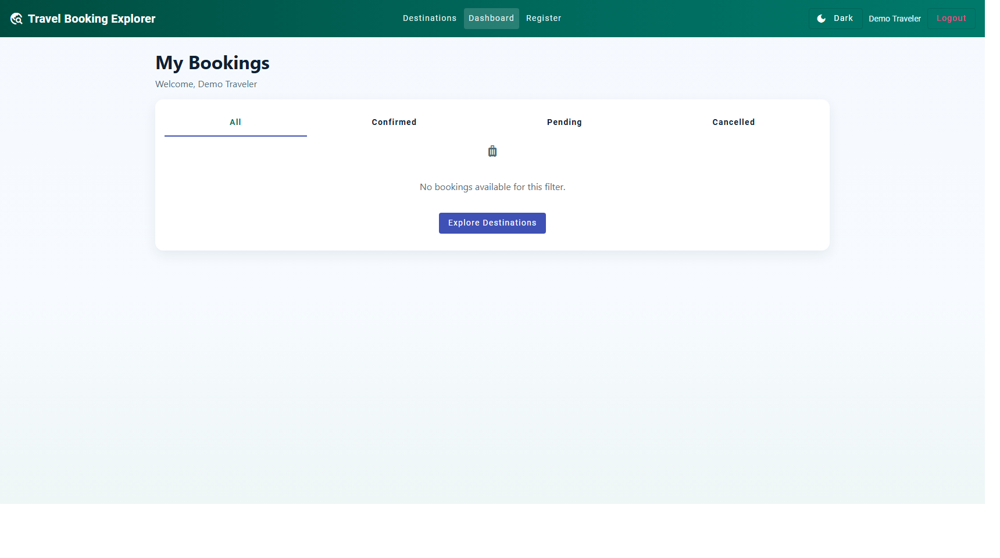
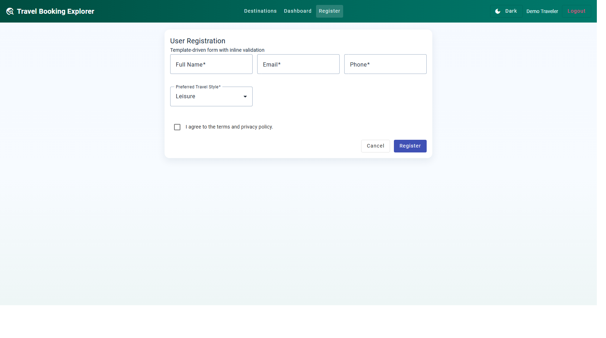

# Travel Booking Explorer

A production-style Angular + TypeScript single-page application for exploring destinations, browsing curated travel packages, and completing bookings with validation, theming, and dashboard tracking.

## Project Overview

Travel Booking Explorer demonstrates complete front-end architecture for a travel platform:

- Explore destination cards with filters by search, country, budget, and rating
- Open package catalogs for each destination
- View package detail tabs (overview, itinerary, reviews)
- Complete booking through a validated reactive form with date picker
- Register users through a template-driven form
- Track bookings in a guarded dashboard

### Current Data Scale

- 21 destinations (3+ per continent)
- 126 packages (6 per destination)
- Detailed long-form descriptions and itinerary items for each package

## Screenshots

### Destinations Explorer


### Packages List


### Package Details


### Booking Form


### User Dashboard


### Registration Form


## Key Features

### 1) TypeScript Models and Strong Typing

- Interfaces for `Destination`, `Package`, `User`, and `Booking`
- Reusable typed services and component contracts

### 2) Modular Angular Architecture

- Standalone component architecture
- Reusable feature modules through components, services, pipes, directives, and guards

### 3) Routing and Navigation

- Route parameters: `/packages/:id`, `/package/:id`, `/booking/:id`
- Child routes inside package detail: `/overview`, `/itinerary`, `/reviews`
- Protected route for dashboard via `authGuard`

### 4) Services and Dependency Injection

- `DestinationService`, `PackageService`, `BookingService`, `UserService`
- Shared state and business logic with RxJS streams

### 5) Forms and Validation

- Reactive booking form
  - Required fields
  - Email and 10-digit phone validation
  - Calendar-based travel date picker with date range checks
- Template-driven user registration form with inline errors

### 6) Pipes and Directives

- Custom `destinationFilter` pipe for multi-criteria filtering
- `appHighlightOffer` directive for top-rated and promotional highlighting
- Built-in pipes such as `CurrencyPipe` and `DatePipe`

### 7) Angular Material UI

- Material toolbar, cards, tabs, tables, dialogs, chips, form fields, buttons, icons
- Responsive layout for desktop and mobile
- Readability-first color system
- Dark/Light theme toggle with persistence

### 8) Observables, HTTP, and Error Handling

- `BehaviorSubject`-driven booking updates
- HTTP interceptors:
  - `loadingInterceptor`
  - `errorInterceptor`
  - `mockApiInterceptor`
- Global snackbar notifications for success/error feedback

### 9) Integration and Testing

- Unit tests for app shell, booking form, and core services
- Build and test pipeline validated

## Additional Interactive Enhancements

- Favorites for packages (persisted in storage)
- Show More/Show Less for long package descriptions
- Random discovery actions:
  - `Surprise Me` for destinations
  - `Surprise Package` for packages
- Image fallback handling for unavailable URLs

## Application Flow

1. `DestinationListComponent` loads destinations and packages, then computes starting prices.
2. User navigates to `/packages/:id` to view destination-specific packages.
3. User opens package details at `/package/:id/overview` and browses child tabs.
4. User books from `/booking/:id`.
5. Booking submission goes to `/mock-api/bookings`, handled by the mock API interceptor.
6. Dashboard updates booking history in real time using observable state.

## Tech Stack

- Angular 21 (standalone components)
- TypeScript
- RxJS
- Angular Material
- Vitest (Angular test builder)

## Project Structure

```text
src/
  app/
    components/
    services/
    models/
    guards/
    interceptors/
    pipes/
    directives/
  assets/
    data/
docs/
  screenshots/
```

## Getting Started

### Prerequisites

- Node.js 20.x or 22.x LTS recommended
- npm 10+

### Install

```bash
npm install
```

### Run Development Server

```bash
npm run start
```

Open `http://localhost:4200`.

## Scripts

- `npm run start` - Start Angular dev server
- `npm run build` - Build production bundle
- `npm run test -- --watch=false` - Run test suite once

## Build and Test

```bash
npm run build
npm run test -- --watch=false
```

## Notes

- The booking API is mocked through `mock-api.interceptor.ts`; no external backend is required.
- Local storage is used for session data such as theme and package favorites.
